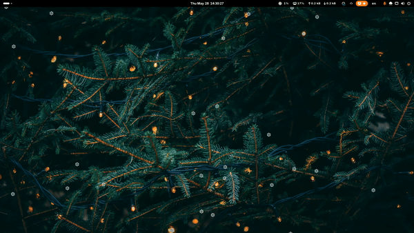
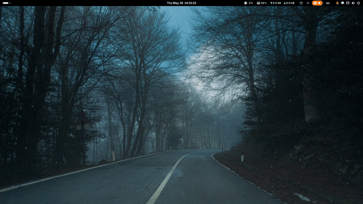

# Weather Effect GNOME Extension


## Description

Weather Effect is a GNOME Shell extension that adds beautiful animated weather effects (snow or rain) to your desktop wallpaper or as a full-screen overlay. Enjoy the magic of falling snowflakes or raindrops on your GNOME desktop!

## Preview

### Snow Effect



### Rain Effect



### Key Features

- ❄️ **Snow Effect**: Beautiful animated snowflakes falling on your desktop
- 🌧️ **Rain Effect**: Realistic rain animation with customizable particles
- **Display Modes**:
  - **Wallpaper Mode**: Effects only on desktop wallpaper background
  - **Screen Mode**: Full-screen overlay that works even in overview
- **Customizable Settings**:
  - Particle count (5-50)
  - Particle size (4-32 pixels)
  - Speed control (Slow, Medium, Fast)
  - Color customization for snow and rain
  - Custom emoji support (❄, ❅, ❆, 💧)
- **Multi-Monitor Support**: Automatically works across all connected monitors
- **Smart Behavior**: Pauses when desktop is obscured by fullscreen windows
- **Quick Settings Integration**: Easy access through GNOME Quick Settings menu

## Installation

### Prerequisites

- GNOME Shell 45+

### Quick Installation

1. **Download last [weather-effect@quinsaiz.github.shell-extension.zip](https://github.com/quinsaiz/weather-effect/releases)**

2. **Install:**

   ```bash
   gnome-extensions install weather-effect@quinsaiz.github.shell-extension.zip
   ```

3. **Log out and log back in**

## Building from Source

If you want to build the extension from source code, follow these steps:

### Prerequisites for Building

- **[Node.js](https://nodejs.org/)** (v16 or higher)
- **npm** (comes with Node.js)
- **glib-compile-schemas** (usually comes with GNOME development packages)

#### Ubuntu/Debian

```bash
sudo apt install nodejs npm gir1.2-glib-2.0
```

#### Fedora

```bash
sudo dnf install nodejs npm glib2-devel
```

#### Arch

```bash
sudo pacman -S nodejs npm glib2
```

### Build Steps

1. **Clone the repository:**

   ```bash
   git clone https://github.com/quinsaiz/weather-effect.git && \
   cd weather-effect
   ```

2. **Install dependencies:**

   ```bash
   npm i
   ```

3. **Build the extension:**

   ```bash
   npm run build
   ```

   This will:

   - Compile TypeScript files to JavaScript
   - Create the extension archive `.zip`

   ---

   **To compile and install the extension directly, run:**

   ```bash
   npm run install
   ```

   This will:

   - Compile TypeScript files to JavaScript
   - Create the extension archive `.zip`
   - Install it into your local extensions directory

## Usage

1. **Open Quick Settings** by clicking the system menu in the top-right corner
2. **Click the Weather Effect toggle** (weather icon)
3. **Select effect type**:
   - Choose between **Snow** ❄️ or **Rain** 🌧️ using the horizontal selector buttons
4. **Configure settings** (optional):
   - Open GNOME Extensions app
   - Find **Weather Effect** and click the settings icon.
   - Adjust particle count, size, speed, colors, and display mode

## Project Structure

```text
weather-effect/
├── LICENSE
├── package.json
├── package-lock.json
├── README.md
├── scripts/
│   └── build.sh                    # Build and installation script
├── src/
│   ├── ambient.d.ts                # Ambient type definitions for GJS
│   ├── extension.ts                # Main extension entry point
│   ├── metadata.json               # Extension manifest
│   ├── prefs.ts                    # Preferences window
│   ├── lib/
│   │   ├── Debug.ts                # Centralized logging
│   │   ├── MonitorManager.ts       # Monitor actor management
│   │   ├── ObscurationManager.ts   # Window obscuration detection
│   │   ├── ParticleManager.ts      # Particle creation & animation
│   │   ├── UIManager.ts            # Quick Settings UI components
│   │   └── WeatherEffectController.ts # Main orchestrator
│   └── schemas/
│       └── org.gnome.shell.extensions.weather-effect.gschema.xml # GSettings schema
└── tsconfig.json                   # TypeScript compiler options
```

## Configuration

The extension can be configured through the GNOME Extensions app settings:

- **Effect Type**: Snow or Rain
- **Display Mode**: Wallpaper only or Full screen overlay
- **Particle Count**: 5 to 50 particles
- **Particle Size**: 4 to 32 pixels
- **Speed**: Slow, Medium, or Fast
- **Snow Color**: White, Light Blue, or Silver
- **Rain Color**: Gray or Dark Blue
- **Custom Emojis**: Choose emoji or use default shapes

## Author

### quinsaiz

GitHub: <https://github.com/quinsaiz>

## License

This project is licensed under the [GPLv3 License](/LICENSE).
